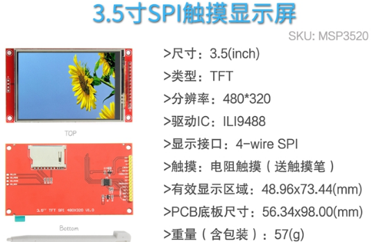

# 结果展示
1. 只要使用java生成480*320像素的内容就可以通过屏幕展示：

# 屏幕规格
1. 以下是我某宝买的屏幕截图，需要的自行搜索：

# 关键点讲解
1. 树莓派接线
    屏幕-------------> 树莓派(BCM引脚，这个要特别注意！见下图红框框的引脚编码)
    SDO/MISO ---- >  MISO
    LED          ------>  GPIO 18
    SCK    ---------->  SCLK
    SDI/MOSI ------>  MOSI
    DC/RS  --------->  GPIO24
    RESET  --------->  GPIO 25
    CS  -------------> CE0 （所以java控制树莓派时，spi的通道是0。我们可以CE1接另一个LCD屏幕，这样就可以使用树莓派同时控制两个屏幕了，但是这另接的屏幕，通道是1）
    GND ----------->  GND
    VSS ------------> 3.3V
    
2. 代码已经上传至gitHub，主要是驱动模块，java语言很简单，一看就懂初始化驱动的初始化指令等。[这里](https://github.com/chenqide163/chenqiIli9488_480x320LCD/tree/main/src/main/java/com/chenqi/tft/ili9488) 是代码地址
# 关键代码讲解
1. 初始化，需要先reset，这块代码就是，很简单：com.chenqi.tft.ili9488.Ili9488Driver#LcdReset
2. 初始化指令见关键方法：com.chenqi.tft.ili9488.Ili9488Driver#init   具体初始化了啥，我也不很清楚，反正能用，先驱动起来了，能人再自行优化。
    1. 有个关键处，见以下指令，我们指定的是18bit的颜色格式
    ```java
    sendCommand(0x3A);    // *** INTERFACE PIXEL FORMAT: 0x66 -> 18 bit; 0x55 -> 16 bit
    sendData(0x66);
    ```
    ili9488 datasheel中对18bit颜色的数据要求是这样的（详见githun，ducuments内ILI9488.pdf中的4.7.5.2章节），总之，一个像素需要传入RGB共3个byte：
    
3. 初始化ili9488后，还需要再指定写入的窗体大小，见代码：com.chenqi.tft.ili9488.Ili9488Driver#setWindow
    1. 直接指定整个屏幕，也就是宽，从0~(320-1)。高从0~(480-1)。
    2. 这里再说明一下我这个初始化的坐标，应该还有其他坐标的方式，但是我这个初始化的坐标就是以下这种方式。
    
4. 指定窗体之后，就可以对这个窗体进行写入颜色序列了。
    1. 如果每次写入1个byte，不断的循环，即用com.chenqi.tft.ili9488.Ili9488Driver#sendData  方法写入颜色序列，效率会非常低，刷新整个屏幕需要16秒多
    2. 所以这里使用com.pi4j.wiringpi.Spi#wiringPiSPIDataRW(int, byte[], int)   这个方法写入颜色序列，效率非常高，刷新整个屏幕只要1秒钟，虽然还是不很快，总的说要比16秒还是快很多的。如果哪位大佬知道更好的方法，请留言指教，我再进行优化，谢谢
        1. 使用这个方法之前，需要先进行Spi的初始化，见代码：
        ```java
        Spi.wiringPiSPISetup(0, 64000000);  //0表示通道0，即上文电路接线提到的：CS  -------------> CE0
        ```
        2. wiringPiSPIDataRW方法有个奇怪的点，就是不能一次写入整个屏幕的颜色数据，不知道是做了什么限制，如有大佬知道，请不吝赐教
        3. 所以，我就一行颜色作为一次写入的序列，一行一行的调用wiringPiSPIDataRW方法写入。可行。
# 完
代码也是借鉴别人的初始化方式来的，但是我觉得java的更容易看懂，贴出来给大家参考下。如有写的不对的地方，请提出来，一起进步，谢谢。
